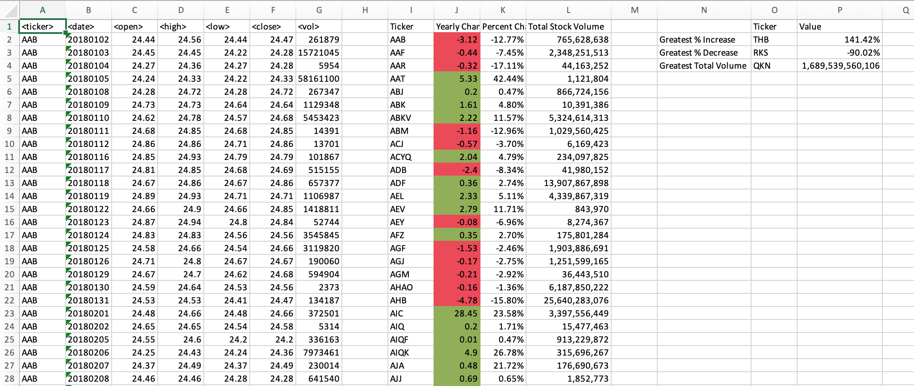

# VBA-challenge

### Module 2 Challenge (for Vanderbilt Data Analytics Bootcamp)
---
VBA script that summarizes daily stock sales data and outputs the following:

For each stock:
---
- Yearly change in price
- Change in price as a percentage
- Total volume of stock

Overall:
---
- Stock with greatest percent increase
- Stock with greatest percent decrease
- Stock with greatest total volume

Example:

